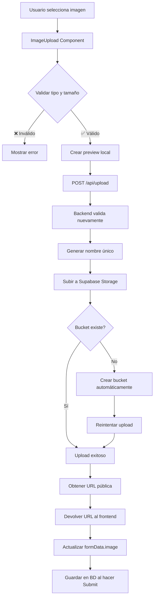

# Configuración de Supabase Storage para HappyCheese

## 📋 Análisis del Flujo Actual

### 1. **Componentes del Sistema de Subida**

#### Frontend (Componente ImageUpload)
Ubicación: `/components/ui/image-upload.tsx`

**Funcionalidades:**
- ✅ Drag & drop de imágenes
- ✅ Preview local de la imagen antes de subir
- ✅ Validación de tipo de archivo (solo imágenes)
- ✅ Loader mientras sube
- ✅ Botón para eliminar imagen
- ✅ Llamada al endpoint `/api/upload`

**Flujo:**
1. Usuario selecciona o arrastra una imagen
2. Se crea un preview local (FileReader)
3. Se envía el archivo al endpoint `/api/upload` como FormData
4. Recibe la URL pública y la pasa al componente padre mediante `onChange(url)`

#### Backend (Endpoint de Upload)
Ubicación: `/app/api/upload/route.ts`

**Funcionalidades:**
- ✅ Recibe archivos mediante FormData
- ✅ Validación de tipo (debe ser imagen)
- ✅ Validación de tamaño (máx. 5MB)
- ✅ Generación de nombre único: `{timestamp}-{random}.{ext}`
- ✅ Sube a Supabase Storage bucket `happycheese-images`
- ✅ Crea el bucket automáticamente si no existe
- ✅ Devuelve la URL pública de la imagen

**Estructura de carpetas:**
```
happycheese-images/
└── flavors/
    ├── 1234567890-abc123.jpg
    ├── 1234567891-def456.png
    └── ...
```

#### Uso en FlavorDialog
Ubicación: `/components/admin/FlavorDialog.tsx`

```tsx
<ImageUpload
  value={formData.image || ''}
  onChange={(url) =>
    setFormData((prev) => ({ ...prev, image: url }))
  }
/>
```

El URL se guarda en el campo `image` del sabor y luego se persiste en la base de datos.

---

## 🚨 **LO QUE FALTA CONFIGURAR EN SUPABASE**

### ⚠️ **CRÍTICO: Storage Bucket**

Actualmente **SOLO tienes creadas las tablas de la base de datos**, pero **NO has configurado Supabase Storage**.

### Pasos para Configurar Storage:

#### 1. **Crear el Bucket Manualmente** (Recomendado)

Ve a tu proyecto de Supabase:
1. Panel izquierdo → **Storage**
2. Click en **"New bucket"**
3. Configuración:
   ```
   Nombre: happycheese-images
   Público: ✅ SÍ (para que las URLs sean accesibles)
   File size limit: 5242880 (5MB en bytes)
   Allowed MIME types: image/jpeg, image/jpg, image/png, image/webp, image/gif
   ```

#### 2. **Configurar Políticas de Storage (RLS)**

Las políticas de seguridad para Storage son DIFERENTES a las de las tablas.

Ve a: **Storage** → **Policies** → Bucket `happycheese-images`

**Política 1: Lectura Pública (GET)**
```sql
CREATE POLICY "Allow public read access"
ON storage.objects
FOR SELECT
USING (bucket_id = 'happycheese-images');
```

**Política 2: Subida Autenticada (INSERT)**
```sql
CREATE POLICY "Allow authenticated uploads"
ON storage.objects
FOR INSERT
WITH CHECK (
  bucket_id = 'happycheese-images' 
  AND (storage.foldername(name))[1] = 'flavors'
);
```

**Política 3: Borrado Autenticado (DELETE)**
```sql
CREATE POLICY "Allow authenticated deletes"
ON storage.objects
FOR DELETE
USING (
  bucket_id = 'happycheese-images' 
  AND (storage.foldername(name))[1] = 'flavors'
);
```

#### 3. **Variables de Entorno**

Asegúrate de tener en tu `.env.local`:

```env
NEXT_PUBLIC_SUPABASE_URL=https://tu-proyecto.supabase.co
NEXT_PUBLIC_SUPABASE_ANON_KEY=tu-anon-key-aqui
SUPABASE_SERVICE_ROLE_KEY=tu-service-role-key-aqui
```

**¿Dónde encontrar estas claves?**
- Ve a tu proyecto Supabase
- **Settings** → **API**
- Copia:
  - `Project URL` → `NEXT_PUBLIC_SUPABASE_URL`
  - `anon public` → `NEXT_PUBLIC_SUPABASE_ANON_KEY`
  - `service_role` → `SUPABASE_SERVICE_ROLE_KEY` ⚠️ **NUNCA expongas esta en el cliente**

---

## 🔍 **Análisis del Código Actual**

### ✅ **Aspectos Positivos**

1. **Validación robusta:**
   - Tipo de archivo
   - Tamaño máximo (5MB)
   
2. **Nombres únicos:**
   ```typescript
   const fileName = `${Date.now()}-${Math.random().toString(36).substring(2)}.${fileExt}`
   ```
   Evita colisiones de nombres.

3. **Creación automática del bucket:**
   ```typescript
   if (error.message.includes('not found')) {
     await supabaseAdmin.storage.createBucket('happycheese-images', {
       public: true,
       fileSizeLimit: maxSize,
     })
   }
   ```
   Si el bucket no existe, lo crea automáticamente.

4. **Uso correcto de Service Role Key:**
   ```typescript
   const supabaseAdmin = createClient(supabaseUrl, supabaseServiceKey, {
     auth: {
       autoRefreshToken: false,
       persistSession: false
     }
   })
   ```
   Evita limitaciones de RLS al subir archivos.

5. **Preview local antes de subir:**
   ```typescript
   const reader = new FileReader()
   reader.onloadend = () => {
     setPreview(reader.result as string)
   }
   reader.readAsDataURL(file)
   ```

### ⚠️ **Aspectos a Mejorar**

#### 1. **Falta manejo de errores detallado**

El código actual solo muestra errores genéricos. Mejora:

```typescript
// En image-upload.tsx
const processFile = async (file: File) => {
  setIsUploading(true)
  setError(null) // nuevo estado
  
  try {
    // Validación de tamaño ANTES de subir
    const maxSize = 5 * 1024 * 1024 // 5MB
    if (file.size > maxSize) {
      throw new Error('La imagen no debe superar los 5MB')
    }

    // Validación de tipo
    const allowedTypes = ['image/jpeg', 'image/jpg', 'image/png', 'image/webp']
    if (!allowedTypes.includes(file.type)) {
      throw new Error('Solo se permiten archivos JPG, PNG o WebP')
    }

    // Preview local
    const reader = new FileReader()
    reader.onloadend = () => setPreview(reader.result as string)
    reader.readAsDataURL(file)

    // Subir
    const url = await uploadToSupabase(file)
    onChange(url)
  } catch (error) {
    console.error('Error uploading image:', error)
    setPreview(null)
    setError(error instanceof Error ? error.message : 'Error al subir imagen')
    // Mostrar toast o mensaje de error
  } finally {
    setIsUploading(false)
  }
}
```

#### 2. **Eliminar imágenes antiguas al actualizar**

Cuando actualizas un sabor con nueva imagen, la imagen antigua queda en Storage.

**Solución:** Agregar función de limpieza:

```typescript
// En route.ts
export async function DELETE(request: Request) {
  try {
    const { searchParams } = new URL(request.url)
    const filePath = searchParams.get('path')
    
    if (!filePath) {
      return NextResponse.json({ error: 'Path requerido' }, { status: 400 })
    }

    const { error } = await supabaseAdmin.storage
      .from('happycheese-images')
      .remove([filePath])

    if (error) {
      console.error('Delete error:', error)
      return NextResponse.json({ error: 'Error al eliminar' }, { status: 500 })
    }

    return NextResponse.json({ success: true })
  } catch (error) {
    console.error('Delete error:', error)
    return NextResponse.json({ error: 'Error al eliminar' }, { status: 500 })
  }
}
```

**Usar en use-flavors-manager.ts:**

```typescript
const updateFlavor = async (flavor: Flavor): Promise<boolean> => {
  try {
    // Si cambió la imagen, eliminar la antigua
    const oldFlavor = flavors.find(f => f.id === flavor.id)
    if (oldFlavor?.image && oldFlavor.image !== flavor.image) {
      // Extraer path de la URL
      const oldPath = oldFlavor.image.split('/').slice(-2).join('/')
      await fetch(`/api/upload?path=${encodeURIComponent(oldPath)}`, {
        method: 'DELETE'
      })
    }

    // Actualizar normalmente
    const res = await fetch('/api/flavors', {
      method: 'PUT',
      headers: { 'Content-Type': 'application/json' },
      body: JSON.stringify(flavor)
    })

    // ... resto del código
  } catch (error) {
    // ... manejo de errores
  }
}
```

#### 3. **Optimización de imágenes**

Las imágenes se suben tal cual. Considera usar compresión/resize:

```bash
npm install sharp
```

```typescript
// En route.ts
import sharp from 'sharp'

export async function POST(request: Request) {
  try {
    const formData = await request.formData()
    const file = formData.get('file') as File

    // ... validaciones ...

    // Convertir y optimizar con sharp
    const arrayBuffer = await file.arrayBuffer()
    const buffer = Buffer.from(arrayBuffer)
    
    const optimizedBuffer = await sharp(buffer)
      .resize(1200, 800, { 
        fit: 'inside',
        withoutEnlargement: true 
      })
      .jpeg({ quality: 85 })
      .toBuffer()

    // Subir buffer optimizado
    const { data, error } = await supabaseAdmin.storage
      .from('happycheese-images')
      .upload(filePath, optimizedBuffer, {
        contentType: 'image/jpeg',
        upsert: false
      })

    // ... resto del código
  }
}
```

#### 4. **Agregar loading states más informativos**

```tsx
{isUploading ? (
  <>
    <Loader2 className="h-10 w-10 text-primary animate-spin" />
    <p className="text-sm text-muted-foreground">
      Subiendo imagen... {uploadProgress}%
    </p>
  </>
) : (
  // ... contenido normal
)}
```

---

## 📝 **Checklist de Configuración**

### En Supabase Dashboard:

- [ ] Crear bucket `happycheese-images` en Storage
- [ ] Marcar como **público**
- [ ] Configurar límite de tamaño (5MB)
- [ ] Agregar políticas RLS para Storage (SELECT, INSERT, DELETE)
- [ ] Copiar `SUPABASE_SERVICE_ROLE_KEY` desde Settings > API

### En tu Proyecto:

- [ ] Verificar `.env.local` tiene las 3 variables correctas
- [ ] Probar subida de imagen desde panel admin
- [ ] Verificar que la URL pública sea accesible
- [ ] Verificar que se muestra en el frontend

### Testing:

```bash
# Verificar que el bucket existe
curl -X GET \
  "https://TU_PROYECTO.supabase.co/storage/v1/bucket/happycheese-images" \
  -H "Authorization: Bearer TU_SERVICE_ROLE_KEY"

# Debería devolver info del bucket
```

---

## 🎯 **Flujo Completo de Subida**



---

## 🚀 **Próximos Pasos Recomendados**

1. **AHORA (Configuración básica):**
   - ✅ Crear bucket en Supabase Dashboard
   - ✅ Configurar políticas RLS para Storage
   - ✅ Agregar variables de entorno
   - ✅ Probar subida de imagen

2. **PRONTO (Mejoras):**
   - 🔄 Implementar eliminación de imágenes antiguas
   - 🔄 Agregar compresión/optimización de imágenes
   - 🔄 Mejorar mensajes de error
   - 🔄 Agregar barra de progreso de subida

3. **FUTURO (Optimización):**
   - 📌 CDN para servir imágenes más rápido
   - 📌 Convertir a WebP automáticamente
   - 📌 Generar múltiples tamaños (thumbnails, medium, large)
   - 📌 Lazy loading de imágenes en el frontend

---

## 📞 **Soporte**

Si al subir una imagen obtienes errores como:
- `Bucket not found` → Crear el bucket manualmente en Supabase
- `403 Forbidden` → Revisar políticas RLS del Storage
- `401 Unauthorized` → Verificar `SUPABASE_SERVICE_ROLE_KEY`
- `Request Entity Too Large` → Imagen supera 5MB

---

**Fecha:** 18 de marzo de 2026  
**Versión:** 1.0
